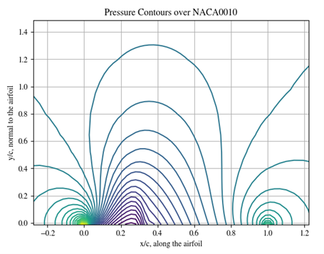

## Transonic flow solver over an NACA00XX airfoil ##

This work attempts to solve the steady aerodynamics over an airfoil in transonic regimes. The goal is to capture local supersonic flow and the associated sonic and shock discontinuities in the flow through numerical solutions to the small disturbance potential equation. The 2D velocity potential equations are first described below:

These may be reduced down by assuming: 
1. Cross-terms, like phi_x*phi_y, are small,
2. Time-derivatives are zero (i.e, only solving the steady state)
3. The flow is inviscid, attached, and irrotational.

The reduced equation is then:

This solver uses a "switching" mechanism to solve the equations based on if they're locally elliptic (or subsonic) or hyperbolic (supersonic) to respect the characteristic upwinding of the solution. This is iterated using a SLOR technique to successively relax the solution towards convergence. Finally, under this formulation, the solver can determine the pressure contour in the mesh, local velocity perturbations (from freestream), and the cp along the airfoil surface. Finally, it supports two dirichlet upper boundary conditions: open air or a wind-tunnel approximation. Key details are found in the attached word document, and some example figures are found below:

*Cp along the airfoil experiencing transonic flow at M = 0.80. The solver effectively captures the shock towards the thickest part of the airfoil, while maintaining a stable solution*

*Pressure contours along the airfoil experiencing transonic flow at M = 0.80. Locally low pressure regions match expectations around the fastest flow that becomes locally supersonic before traversing a shockline*

*Convergence history of the solution for around 1,000 iterations, where the residual (defined in the attached documentation) represents the deviation from the fully-relaxed solution*
